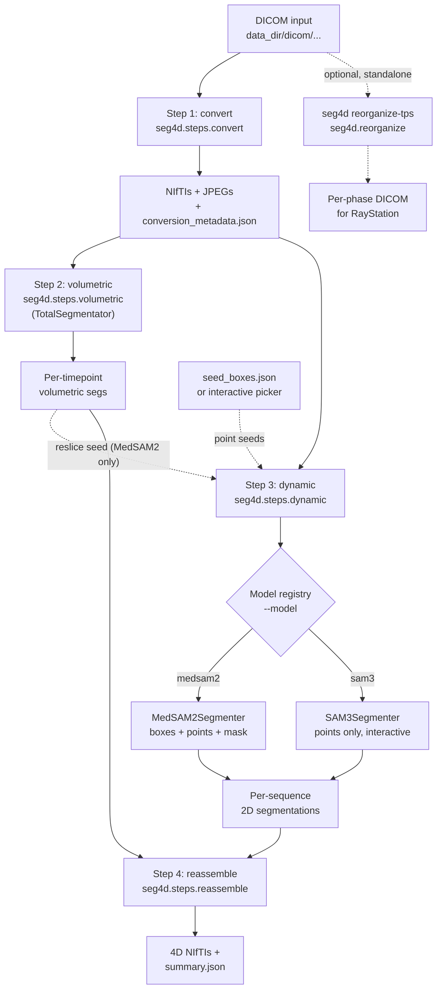

# seg4d - 4D medical image segmentation

`seg4d` is a  modular pipeline for segmenting **4D MR / CT** datasets
(volumetric 3D + time *and* 2D dynamic + time) of abdominal organs (liver,
right and left kidneys). It combines:

- **TotalSegmentator** for volumetric (3D + time) sequences;
- **MedSAM2** *or* **SAM3** as a swappable, tracker-based backend for 2D
  dynamic (single-slice + time) sequences;
- a separate **per-phase DICOM exporter** for RayStation TPS.

A single CLI exposes every step. Backends are selected with `--model
{medsam2, sam3}`; `seed_boxes.json` and the SAM3 interactive point picker
work the same way they did in the original scripts.

## Architecture



A more detailed module map lives in [`docs/architecture.md`](docs/architecture.md).

## Repository layout

```
seg4d/
  README.md
  LICENSE                      (MIT)
  requirements-all.txt         single-environment deps (recommended)
  requirements.txt             shared deps only
  requirements-medsam2.txt     MedSAM2-only deps
  requirements-sam3.txt        SAM3-only deps
  setup/
    setup_all.bat              one-shot Windows setup (recommended)
    setup_medsam2.sh / .bat    MedSAM2-only setup
    setup_sam3.sh  / .bat      SAM3-only setup
  docs/                        architecture, data layout, seed schema
  examples/                    walkthrough on the example PN001_MR1_MIT dataset
  seg4d/                       Python package
    cli.py / __main__.py       CLI
    pipeline.py                orchestrator
    constants.py
    io/                        DICOM -> NIfTI / JPEG
    geometry/                  resampling and cross-plane reslicing
    postprocess/               mask morphology
    seeds/                     seed_boxes.json schema, GUI picker, previews
    models/                    VideoSegmenter ABC + registry + backends
    steps/                     Steps 1-4
    reorganize/                DICOM phase exporter for RayStation
```

## Quickstart

### 1. Install

**One environment runs both backends.** You only need Python 3.12 and Git —
no conda required.

#### Windows (recommended)

```bat
cd seg4d\setup
setup_all.bat
```

This creates a venv at `C:\envs\seg4d`, installs PyTorch 2.7.0 (CUDA 12.6),
all Python deps, MedSAM2, and logs into HuggingFace for the SAM3 weights.

#### Linux / macOS

```bash
python3.12 -m venv ~/.venvs/seg4d
source ~/.venvs/seg4d/bin/activate

pip install torch==2.7.0 torchvision torchaudio \
    --index-url https://download.pytorch.org/whl/cu126
pip install -r requirements-all.txt

git clone https://github.com/bowang-lab/MedSAM2.git
cd MedSAM2 && pip install -e ".[dev]" && python tools/download_ckpts.py && cd ..

huggingface-cli login   # facebook/sam3 weights are gated
```

#### Per-backend envs (optional)

If you only need one model, or need to pin exact CUDA versions:

```bash
# MedSAM2 only (CUDA 12.4)
bash setup/setup_medsam2.sh

# SAM3 only (CUDA 12.6)
bash setup/setup_sam3.sh   # or setup_sam3.bat on Windows
```

#### Activate

```bat
REM Windows
C:\envs\seg4d\Scripts\activate.bat
cd seg4d
```

```bash
# Linux / macOS
source ~/.venvs/seg4d/bin/activate
cd seg4d
```

### 2. Convert DICOMs + generate seed references

Steps 1 and 2 are model-independent — run them once:

```bash
python -m seg4d run --data_dir 4D_MR/PN001_MR1_MIT --steps convert,volumetric
python -m seg4d generate-seeds --data_dir 4D_MR/PN001_MR1_MIT
```

Outputs land under `<data_dir>/nifti/`, `<data_dir>/results/`, and
`<data_dir>/seed_templates/`. Open the gridded reference images in
`seed_templates/` and fill in `seed_boxes.json` with pixel coordinates for
each organ.

### 3. Run dynamic segmentation (pick a model)

```bash
# SAM3 — point prompts from seed_boxes.json
python -m seg4d run --data_dir 4D_MR/PN001_MR1_MIT \
    --steps dynamic,reassemble --model sam3 --seed_mode boxes

# MedSAM2 — box/point prompts, re-seeded on 3 frames
python -m seg4d run --data_dir 4D_MR/PN001_MR1_MIT \
    --steps dynamic,reassemble --model medsam2 \
    --seed_mode boxes --seed_frames 0,250,500

# MedSAM2 — reslice mode (seeds derived from TotalSegmentator, no prompts needed)
python -m seg4d run --data_dir 4D_MR/PN001_MR1_MIT \
    --steps dynamic,reassemble --model medsam2 --seed_mode reslice
```

> **Interactive picker** (`--interactive`): adds a matplotlib GUI for
> placing positive/negative points before inference. Requires a display;
> on a headless server use X11 forwarding (`ssh -X`) or prepare
> `seed_boxes.json` locally first.

### 4. Export per-phase DICOMs for RayStation

```bash
python -m seg4d reorganize-tps --data_dir 4D_MR/PN001_MR1_MIT --evenly_spaced
```

See [`docs/data_layout.md`](docs/data_layout.md) for the directory contract
and [`docs/seed_format.md`](docs/seed_format.md) for the `seed_boxes.json`
schema.

## Model comparison

| Feature | TotalSegmentator | MedSAM2 (`--model medsam2`) | SAM3 (`--model sam3`) |
|---|---|---|---|
| Pipeline step | Step 2 (volumetric) | Step 3 (dynamic) | Step 3 (dynamic) |
| Operates on | Volumetric 3D+time series | 2D dynamic series | 2D dynamic series |
| Output | 3D label map per timepoint | 2D mask per frame | 2D mask per frame |
| Prompts needed | None (fully automatic) | Box / point / reslice mask | Point prompts |
| Source | pip package | bowang-lab/MedSAM2 (GitHub) | facebook/sam3 (HuggingFace, gated) |
| Pre-trained on medical images | yes | yes | no (general-purpose) |
| Box prompts | — | yes | no |
| Point prompts | — | yes (positive + negative) | yes (positive + negative) |
| Mask prompts (`--seed_mode reslice`) | — | yes | no |
| Interactive picker (`--interactive`) | — | yes | yes |
| Multi-frame seeding (`--seed_frames`) | — | yes | frame 0 only |
| Visible-organ filter | — | no | yes (sagittal / coronal) |

**TotalSegmentator** and the dynamic backends are complementary, not
interchangeable: TotalSegmentator runs on the thick-slab volumetric
sequence and gives 3D volumes in mL; MedSAM2 / SAM3 run on the thin
2D dynamic sequences and track organ motion frame-by-frame.
In `--seed_mode reslice`, MedSAM2 uses the TotalSegmentator output as
its seed — combining both approaches.

## CLI summary

```
python -m seg4d run --data_dir <D> [--steps STEPS] [--model M] [--device gpu|cpu]
                    [--seed_mode boxes|reslice] [--seed_file F]
                    [--seed_frames 0,250,500] [--interactive]
                    [--medsam2_checkpoint P] [--medsam2_cfg C]
                    [--sam3_model_id ID] [--gpus 0,1]
python -m seg4d generate-seeds --data_dir <D>
python -m seg4d reorganize-tps --data_dir <D> [--evenly_spaced |
                    --phase_map '{"1":"0.0%A",...}'] [--output_dir O]
```

Use `python -m seg4d <subcommand> --help` for the full flag list.

## Requirements

| | Version |
|--|--|
| Python | 3.12 |
| PyTorch | 2.7.0 |
| CUDA (driver) | 12.6+ |
| GPU VRAM | ≥ 8 GB recommended |

All Python deps are captured in `requirements-all.txt`. See `setup/setup_all.bat`
(Windows) or the Linux install block above for the full setup.

## License

[MIT](LICENSE).

## Status

The original `segment_4d_mr.py`, `sam3_pipeline/` and
`reorganize_4d_mr_for_tps.py` scripts at the repo root are kept untouched as
a reference. After validating the refactor on real data they can be removed.
