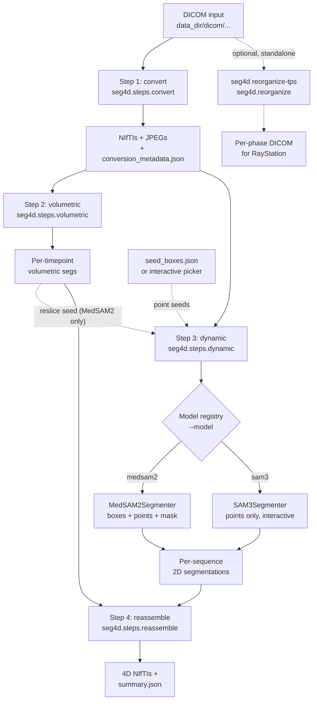

# Architecture

## High-level flow

## Module map

| Module | Role |
| --- | --- |
| `seg4d.cli` / `seg4d.__main__` | Argparse-based CLI; subcommands `run`, `generate-seeds`, `reorganize-tps`. |
| `seg4d.pipeline` | Orchestrates Steps 1-4 from CLI args. |
| `seg4d.constants` | Sequence names, organ IDs, label maps, target spacing. |
| `seg4d.io.dicom_loader` | DICOM grouping (volumetric / 2D dynamic) and SimpleITK-aware series read. |
| `seg4d.io.nifti_writer` | Per-timepoint volumetric NIfTI + 2D dynamic NIfTI/JPEG export. |
| `seg4d.io.metadata` | `conversion_metadata.json` read/write helpers. |
| `seg4d.geometry.resample` | Isotropic resampling for thick-slab MR (and back). |
| `seg4d.geometry.reslice` | Reslice a 3D label map onto an arbitrary 2D dynamic plane. |
| `seg4d.postprocess.morphology` | Organ-aware closing / hole-filling / largest-CC. |
| `seg4d.seeds.schema` | Parser for `seed_boxes.json` (legacy + extended formats). |
| `seg4d.seeds.template` | Gridded reference frames + starter `seed_boxes.json`. |
| `seg4d.seeds.visualize` | Box / point preview rendering. |
| `seg4d.seeds.interactive` | matplotlib GUI for placing positive/negative points. |
| `seg4d.models.base` | `SeedSpec` dataclass + `VideoSegmenter` ABC. |
| `seg4d.models.__init__` | `SEGMENTERS` registry + `build_segmenter`. |
| `seg4d.models.medsam2` | MedSAM2 video predictor wrapper (box + point + mask seeds). |
| `seg4d.models.sam3` | `Sam3TrackerVideoModel` wrapper (point seeds, visible-organ filter). |
| `seg4d.models.totalsegmentator` | TotalSegmentator + isotropic resampling + organ refinement. |
| `seg4d.steps.convert` | Step 1 (DICOM -> NIfTI/JPEG). |
| `seg4d.steps.volumetric` | Step 2 (TotalSegmentator on every volumetric timepoint). |
| `seg4d.steps.dynamic` | Step 3 (model-agnostic 2D dynamic driver). |
| `seg4d.steps.reassemble` | Step 4 (4D NIfTI assembly + `summary.json`). |
| `seg4d.reorganize.tps_export` | Per-phase DICOM exporter (TPS). |
| `seg4d.reorganize.validate` | Sanity checks on the export (UID uniqueness, etc.). |

## Why a registry instead of a flag with `if`s?

The two backends have different runtime dependencies (PyTorch + SAM2 fork on
one side, PyTorch + Transformers on the other) and incompatible weight
sources. Using a string-based registry (`"module.path:ClassName"`) means we
only import the heavy ML packages for the backend the user actually
selected, and adding a new backend is a one-line change in
`seg4d/models/__init__.py`.

## Adding a new backend

1. Create `seg4d/models/<your_model>.py`.
2. Subclass `VideoSegmenter` and implement `load(device)` and
   `segment_sequence(seq_name, seq_meta, seed)`.
3. Set `supports_box_prompts` / `supports_point_prompts` /
   `supports_mask_prompts` to advertise capabilities.
4. Register the class in `SEGMENTERS` in `seg4d/models/__init__.py`.

The dynamic-step driver (`seg4d/steps/dynamic.py`) does the rest: it builds
a `SeedSpec`, dispatches via `build_segmenter`, persists per-organ NIfTIs.
